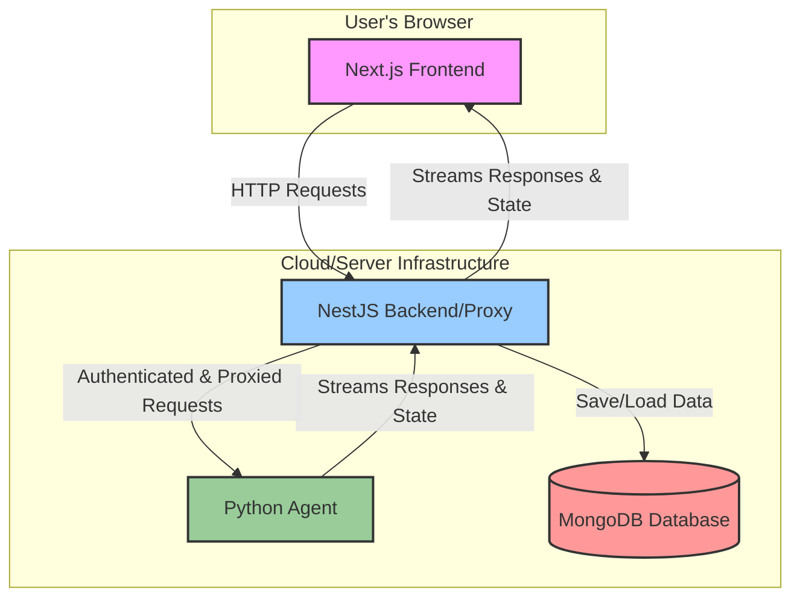

# Beenet – An Agentic Chat Application

[](https://opensource.org/licenses/MIT)

Beenet is a production-ready, agentic chat application featuring a sophisticated Python backend, a secure NestJS proxy, and a modern Next.js UI. It's designed from the ground up to be a robust, scalable, and feature-rich platform for building and deploying AI-powered conversational agents.

 <!-- Placeholder for a real screenshot -->

## ✨ Features

- **🧠 Robust Agent Flow:** A sophisticated agent built with LangGraph that follows a `plan → research → chat` flow, allowing for complex, multi-step reasoning and tool use.
- **🔐 Secure & Scalable Backend:** A NestJS backend acts as a secure proxy, handling user authentication, data persistence, and API key management with features like HMAC signing and encryption-at-rest.
- **💻 Modern Frontend:** A responsive and intuitive UI built with Next.js, shadcn/ui, and Tailwind CSS. It features real-time plan rendering, streaming responses, and a polished markdown experience.
- **🔒 Authentication:** Secure user authentication powered by Clerk.
- **💾 Persistent Conversations:** Chat history is saved to a MongoDB database, allowing users to continue their conversations across sessions.
- **🔑 Secure Key Management:** Users can securely add their own API keys (e.g., for different LLM providers), which are encrypted at rest.
- **🛠️ Extensible:** The monorepo structure and modular design make it easy to extend and customize any part of the application, from the agent's tools to the frontend components.

## 🏗️ Architecture

Beenet is a monorepo composed of three main services that work together:

1.  **`beenet-frontend`**: A Next.js application that provides the user interface.
2.  **`beenet-backend`**: A NestJS application that serves as a secure proxy and handles data persistence.
3.  **`agents/py-agent`**: A Python application that contains the core AI agent logic.

Here is a high-level overview of the architecture:



## 🚀 Tech Stack

- **Frontend:** Next.js, React, TypeScript, Tailwind CSS, shadcn/ui, CopilotKit
- **Backend:** NestJS, TypeScript
- **Agent:** Python, FastAPI, LangChain, LangGraph
- **Database:** MongoDB
- **Authentication:** Clerk
- **Deployment:** Vercel (for frontend/backend), Docker (example for agent)

## 📋 Prerequisites

Before you begin, ensure you have the following installed:

- [Node.js](https://nodejs.org/en/) (v18 or newer)
- [Python](https://www.python.org/downloads/) (v3.12 or newer)
- [MongoDB](https://www.mongodb.com/try/download/community)
- [Git](https://git-scm.com/downloads/)
- A [Clerk](https://clerk.com/) account for authentication.
- API keys for your desired LLM provider (e.g., OpenAI) and for Tavily (for web search).

## ⚙️ Installation and Setup

Follow these steps to get your local development environment set up and running.

### 1. Clone the Repository

```bash
git clone https://github.com/your-username/beenet.git
cd beenet
```

### 2. Configure Environment Variables

You will need to create three separate `.env` files for the three services.

#### a) Backend (`beenet-backend/.env`)

Create a file at `beenet-backend/.env` and add the following variables.

```env
# The port for the backend server to run on.
PORT=4000

# The URL of the frontend application.
FRONTEND_ORIGIN=http://localhost:3000

# Your Clerk secret and publishable keys.
CLERK_SECRET_KEY=
CLERK_PUBLISHABLE_KEY=

# Your MongoDB connection string.
MONGODB_URI=mongodb://127.0.0.1:27017/beenet

# The URL of the Python agent.
AGENT_URL=http://localhost:8000/copilotkit

# A 32-byte base64 encoded string for data encryption.
# Generate one with: openssl rand -base64 32
DATA_KEY=

# A shared secret for proxy-to-agent authentication.
# Generate one with: openssl rand -hex 32
PROXY_SHARED_SECRET=
```

#### b) Frontend (`beenet-frontend/.env.local`)

Create a file at `beenet-frontend/.env.local` and add the following variables.

```env
# The URL of the NestJS backend.
NEXT_PUBLIC_BACKEND_URL=http://localhost:4000
NEXT_PUBLIC_COPILOTKIT_RUNTIME_URL=http://localhost:4000/copilotkit

# Your Clerk publishable key.
NEXT_PUBLIC_CLERK_PUBLISHABLE_KEY=

# Your Clerk secret key (for backend operations in Next.js).
CLERK_SECRET_KEY=
```

#### c) Python Agent (`agents/py-agent/.env`)

Create a file at `agents/py-agent/.env` and add the following variables.

```env
# The shared secret for proxy-to-agent authentication.
# Must match the one in the backend's .env file.
PROXY_SHARED_SECRET=

# Your Tavily API key for web search.
TAVILY_API_KEY=

# (Optional) Your default LLM provider details.
# These can also be set by the user in the UI.
MAIN_MODEL_API_KEY=
MAIN_MODEL_BASE_URL=
MAIN_MODEL_NAME=
```

### 3. Install Dependencies

You need to install the dependencies for both the frontend and the backend.

```bash
# Install dependencies for the backend
cd beenet-backend
npm install
cd ..

# Install dependencies for the frontend
cd beenet-frontend
npm install
cd ..

# Install dependencies for the Python agent
cd agents/py-agent
pip install -r requirements.txt
cd ../..
```

### 4. Running the Application

You must start the services in the following order:

1.  **MongoDB:** Make sure your MongoDB server is running.
2.  **Backend (NestJS):**
    ```bash
    cd beenet-backend
    npm run start:dev
    ```
3.  **Python Agent:**
    ```bash
    cd agents/py-agent
    python main.py
    ```
4.  **Frontend (Next.js):**
    ```bash
    cd beenet-frontend
    npm run dev
    ```

Once all services are running, you can access the application at `http://localhost:3000`.

## 📂 Project Structure

This repository is a monorepo containing the three main services:

-   `beenet-frontend/`: The Next.js frontend application. See the [frontend README](./beenet-frontend/README.md) for more details.
-   `beenet-backend/`: The NestJS backend proxy. See the [backend README](./beenet-backend/README.md) for more details.
-   `agents/py-agent/`: The Python agent. See the [agent README](./agents/py-agent/README.md) for more details.

## 🤝 Contributing

Contributions are welcome! Please feel free to submit a pull request or open an issue.

## 📄 License

This project is licensed under the MIT License. See the [LICENSE](LICENSE) file for details.
