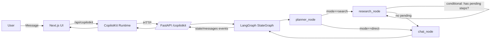

# Beenet Agent (Python)

A LangGraph-based agent exposed via FastAPI and integrated with CopilotKit for state streaming and generative UI.

- Planner → Research(loop via conditional) → Chat flow (ToolNode optional)
- Lightweight planner model; main model for answering
- Emits structured JSON `plan` and streams state to the UI

## High-level architecture



## Nodes and responsibilities

- `planner_node`
  - Strict router; never answers directly
  - Returns a single tool call `set_research_plan` with a typed schema
    - mode: `direct | search`
    - steps: string titles (legacy)
    - structured_steps: `{ title, queries[1..3] }[]` for high-quality queries (include current year)
  - Streams the `plan` and appends to `plans` history
- `research_node`
  - Manual executor (no LLM). Picks the first pending step, marks executing, runs Tavily for each query concurrently, streams result cards `{title,url,favicon}` and quick findings, then marks completed
  - Returns updated state only; graph uses a conditional edge to loop until no pending steps remain
- `chat_node`
  - Tool-free answerer. Persona includes the plan context; when mode='search' the plan is embedded for grounding
- `tool_node` (optional)
  - Placeholder for future custom tools

## Models

Model configuration is defined in `brain/model.py`:

- `get_planner_model()`
  - Lightweight routing model (e.g., `mistralai/mistral-nemotron`) for low latency and cost-efficient planning
- `get_model()`
  - Main answering model (configurable to any compatible provider/model)

Provide provider configuration via environment variables (recommended):

- MAIN_MODEL_BASE_URL
- MAIN_MODEL_API_KEY
- MAIN_MODEL_NAME
- PLANNER_MODEL_BASE_URL (fallbacks to MAIN_MODEL_BASE_URL)
- PLANNER_MODEL_API_KEY (fallbacks to MAIN_MODEL_API_KEY)
- PLANNER_MODEL_NAME

Tavily web search requires:
- TAVILY_API_KEY

Environment loading:
- `main.py` loads a `.env` at startup via `python-dotenv`
- Copy `.env.example` to `.env` and populate required keys

## CopilotKit integration

- Uses `copilotkit_customize_config(config, emit_tool_calls=False)` to avoid raw tool-call emission to the UI
- Streams state with `copilotkit_emit_state(config, state)` so the frontend can render plan/progress in real time
- FastAPI exposes a CopilotKit endpoint at `/copilotkit`

## Endpoints

- FastAPI app: `http://localhost:8000`
- CopilotKit endpoint: `http://localhost:8000/copilotkit`

## Setup

1. Create and activate a Python virtual environment
2. Install dependencies (poetry/pip) and configure provider credentials
3. Start the server

```bash
cd agents/py-agent
python main.py
```

> Pro tip: create `.env` next to `main.py` (or project root) by copying `.env.example` and renaming to `.env`.

## Environment and configuration

- If using environment variables for model configuration, ensure they are loaded before start
- CORS allows the default frontend origin (`http://localhost:3000`); update in `main.py` if needed
- Agent name is `starterAgent` (must match frontend configuration)

## Extending

- Add tools in `tools/` (e.g., additional web APIs) and bind in the appropriate node
- Add new nodes and edges in `brain/graph.py` to extend the workflow
- Extend `AgentState` in `brain/state.py` for additional state fields

## Troubleshooting

- No plan shown: verify `planner_node` emits `plan` as JSON and emits state before model call
- Tool call not firing: ensure planner forces `set_research_plan` tool choice and research binds only `tavily_search`
- UI fetch failed: confirm FastAPI is up and `/copilotkit` is reachable; check CORS and ports

## Security

- Do not commit API keys; store them securely via environment variables or secrets manager
- Validate/limit external tool inputs and results where applicable

