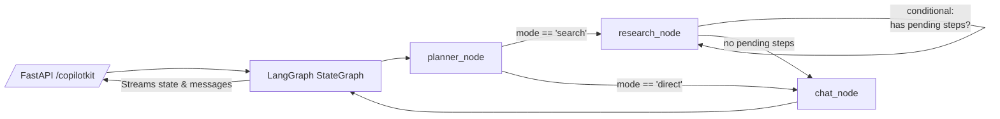

# Beenet Python Agent - Developer's Guide

This document provides a deep dive into the Beenet Python agent for developers looking to understand, extend, or customize its functionality. For setup and installation instructions, please see the [main README](../../README.md).

## 🧠 Agent Architecture

The core of the agent is a state machine built with [LangGraph](https://langchain-ai.github.io/langgraph/). It follows a defined flow to process user requests, moving from planning to research (if necessary), and finally to generating a response.

### High-Level Flow

### Nodes and Responsibilities

-   **`planner_node`**:
    -   Acts as a strict router and does not answer user questions directly.
    -   Its primary role is to decide whether a direct answer is sufficient (`direct` mode) or if web research is needed (`search` mode).
    -   It returns a single tool call to `set_research_plan` with a typed schema, including structured steps like `{ title, queries[] }`.
-   **`research_node`**:
    -   An executor that systematically works through the research plan from the `planner_node`.
    -   For each step, it runs Tavily search queries concurrently, streams back result cards (`{title, url, favicon}`), and provides quick findings.
    -   The graph uses a conditional edge to loop back to this node until all research steps are completed.
-   **`chat_node`**:
    -   The final node that synthesizes an answer for the user.
    -   It is tool-free and generates a response based on the initial query and the context gathered from the research phase (if any).
-   **`tool_node`** (optional):
    -   A placeholder for adding future custom tools to the agent.

### State Management

The agent's state is managed in the `AgentState` TypedDict, defined in `brain/state.py`. This state is passed between nodes in the graph, and includes the message history, the current plan, and any errors.

## 📂 Key Files

-   `main.py`: The FastAPI application entry point. It sets up the server, CORS, and the CopilotKit endpoint.
-   `brain/graph.py`: Defines the LangGraph state machine, including all nodes and the conditional edges that control the flow.
-   `brain/state.py`: Defines the `AgentState` TypedDict that holds the application's state.
-   `brain/model.py`: Contains the logic for loading the different language models (`get_model` and `get_planner_model`).
-   `nodes/`: This directory contains the implementation for each of the core nodes in the graph (`planner.py`, `research.py`, `basic_chat.py`).
-   `tools/`: This directory contains any tools that the agent can use, such as the web search tools.
-   `prompts/`: Contains the prompt templates used by the different nodes.

## 🔧 Extending the Agent

The agent is designed to be extensible. Here are the most common ways to customize it:

-   **Adding New Tools:**
    1.  Create a new tool function in the `tools/` directory.
    2.  Import and bind the tool to the appropriate node in `brain/graph.py`.
    3.  Update the prompts in `prompts/` to make the agent aware of the new tool.
-   **Adding New Nodes:**
    1.  Create a new node function in the `nodes/` directory.
    2.  Add the new node to the graph in `brain/graph.py` and define the edges to integrate it into the flow.
-   **Modifying the State:**
    1.  Extend the `AgentState` TypedDict in `brain/state.py` to include any new state fields you need.

## ⚙️ Environment Variables

The agent is configured via environment variables, which are loaded from a `.env` file at startup.

-   `PROXY_SHARED_SECRET`: The secret key used to verify HMAC-signed requests from the NestJS backend.
-   `TAVILY_API_KEY`: Your API key for Tavily web search.
-   `MAIN_MODEL_API_KEY`, `MAIN_MODEL_BASE_URL`, `MAIN_MODEL_NAME`: Credentials for the main answering model.
-   `PLANNER_MODEL_API_KEY`, `PLANNER_MODEL_BASE_URL`, `PLANNER_MODEL_NAME`: Credentials for the lightweight planner model. If not provided, these fall back to the main model's configuration.

## 🐛 Troubleshooting

-   **Authentication Errors:** Ensure the `PROXY_SHARED_SECRET` matches the one in the backend's `.env` file.
-   **No Plan Shown in UI:** Verify that the `planner_node` is emitting the `plan` as JSON and that it emits the state before the model call.
-   **Tool Call Not Firing:** Ensure the planner is forcing the `set_research_plan` tool choice and that the research node correctly binds the `tavily_search` tool.
-   **Fetch Failed:** Confirm the FastAPI server is running on port 8000 and that the `/copilotkit` endpoint is reachable.
